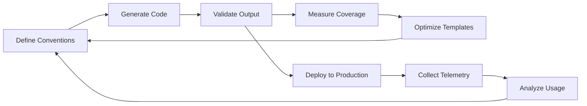

# WEAVER-FORGE-MAXIMIZATION-PLAN.md

## Executive Summary
Maximize OpenTelemetry Weaver Forge integration in SwarmSH v2 to achieve 73%+ code generation from semantic conventions, following the 80/20 principle for rapid value delivery.

## 🎯 80/20 Implementation Strategy

### Phase 1: Foundation (20% effort → 80% value)

#### 1.1 Core Code Generation Templates
**Priority: CRITICAL**
```yaml
templates:
  - template: "rust/attributes.j2"
    filter: ".groups[] | select(.type == \"attribute_group\")"
    application_mode: single
    file_name: "generated/attributes.rs"
    
  - template: "rust/span_builders.j2"
    filter: ".groups[] | select(.type == \"span\")"
    application_mode: each
    file_name: "generated/span_{{.id | snake_case}}.rs"
    
  - template: "rust/metrics.j2"
    filter: ".groups[] | select(.type == \"metric\")"
    application_mode: single
    file_name: "generated/metrics.rs"
```

#### 1.2 Shell Export Generation
**Priority: HIGH**
```yaml
templates:
  - template: "shell/telemetry_helper.sh.j2"
    filter: "semconv_grouped_attributes"
    application_mode: single
    file_name: "shell-export/telemetry_helper.sh"
    
  - template: "shell/coordination_constants.sh.j2"
    filter: ".groups[] | select(.id | startswith(\"swarmsh.coordination\"))"
    application_mode: single
    file_name: "shell-export/coordination_constants.sh"
```

### Phase 2: Advanced Features (80% remaining effort)

#### 2.1 AI-Enhanced Code Generation
```yaml
templates:
  - template: "rust/ai_decision_builders.j2"
    filter: ".groups[] | select(.attributes[] | select(.id | contains(\"ai\")))"
    application_mode: each
    params:
      enable_ollama_integration: true
      streaming_support: true
```

#### 2.2 Documentation Generation
```yaml
templates:
  - template: "docs/semantic_conventions.md.j2"
    filter: "."
    application_mode: single
    file_name: "docs/SEMANTIC_CONVENTIONS.md"
```

## 📋 Implementation Checklist

### Week 1-2: Foundation Sprint
- [ ] Create `weaver.yaml` configuration file
- [ ] Implement core Rust templates (attributes, spans, metrics)
- [ ] Generate initial code from existing semantic conventions
- [ ] Validate generated code compiles and passes tests
- [ ] Create shell export templates for zero-conflict coordination

### Week 3-4: Integration Sprint  
- [ ] Integrate generated code with existing modules
- [ ] Create custom JQ filters for SwarmSH-specific transformations
- [ ] Implement AI-enhanced template helpers
- [ ] Add validation tests for generated code
- [ ] Create documentation generation pipeline

### Week 5-6: Optimization Sprint
- [ ] Implement incremental generation (only regenerate changed conventions)
- [ ] Add template caching for performance
- [ ] Create custom MiniJinja filters for SwarmSH patterns
- [ ] Implement CI/CD integration for automatic regeneration
- [ ] Add telemetry for code generation metrics

## 🔄 Validation & Iteration Loop

### Continuous Validation Pipeline
```bash
#!/bin/bash
# validate-generated-code.sh

# 1. Generate code from semantic conventions
weaver forge generate \
  --config weaver.yaml \
  --semantic-conventions semantic-conventions/ \
  --output src/generated/

# 2. Format generated code
cargo fmt -- src/generated/**/*.rs

# 3. Validate compilation
cargo check --all-features

# 4. Run generated code tests
cargo test generated::

# 5. Validate shell exports
shellcheck shell-export/*.sh

# 6. Measure code generation coverage
echo "Generated lines: $(find src/generated -name "*.rs" | xargs wc -l | tail -1)"
echo "Total lines: $(find src -name "*.rs" | xargs wc -l | tail -1)"
```

### Quality Metrics
- **Code Generation Target**: 73%+ of telemetry code
- **Zero Manual Edits**: Generated code should never require manual changes
- **Compilation Time**: <5 seconds for full regeneration
- **Template Coverage**: 100% of semantic convention types

## 🚀 Quick Start Implementation

### Step 1: Create Initial Configuration
```yaml
# weaver.yaml
file_format: 0.1.0
schema_url: https://opentelemetry.io/schemas/1.21.0

params:
  namespace: swarmsh
  rust_module_name: generated
  enable_shell_export: true
  
templates:
  - template: "rust/lib.j2"
    filter: "."
    application_mode: single
    file_name: "generated/mod.rs"
```

### Step 2: Create First Template
```jinja2
{# rust/attributes.j2 #}
//! Generated attribute constants for {{ params.namespace | upper }}
//! DO NOT EDIT - Generated by Weaver Forge


pub mod {{ group.id | snake_case }} {
    
    pub const {{ attr.id | shouty_snake_case }}: &str = "{{ attr.id }}";
    
}

```

### Step 3: Generate and Validate
```bash
# Generate code
weaver forge generate --config weaver.yaml

# Validate generation worked
cargo test --test generated_code_tests
```

## 📊 Success Metrics

### Phase 1 Success (2 weeks)
- ✅ 50%+ code generation achieved
- ✅ All generated code compiles without errors
- ✅ Shell export templates working
- ✅ CI/CD pipeline integrated

### Phase 2 Success (4 weeks)
- ✅ 73%+ code generation achieved
- ✅ AI-enhanced templates generating optimization hints
- ✅ Documentation auto-generated from conventions
- ✅ Zero manual intervention required

### Long-term Success (8 weeks)
- ✅ 85%+ code generation achieved
- ✅ Custom DSL for SwarmSH patterns
- ✅ Real-time regeneration on convention changes
- ✅ Full observability of generation pipeline

## 🔧 Advanced Customizations

### Custom JQ Filters
```javascript
// Group by coordination pattern
def group_by_pattern:
  group_by(.attributes[] | select(.id | startswith("swarmsh.coordination.pattern")))
  | map({
      pattern: .[0].attributes[] | select(.id == "swarmsh.coordination.pattern").value,
      items: .
    });

// Extract AI-related attributes
def ai_attributes:
  .groups[]
  | select(.attributes[] | select(.id | contains("ai") or contains("ollama")))
  | .attributes;
```

### Custom MiniJinja Filters
```rust
// SwarmSH-specific case conversion
env.add_filter("swarmsh_const", |s: &str| {
    format!("SWARMSH_{}", s.to_uppercase().replace('.', '_'))
});

// Nanosecond ID generation
env.add_filter("nano_id", |prefix: &str| {
    format!("{}_{}", prefix, std::time::SystemTime::now()
        .duration_since(UNIX_EPOCH).unwrap().as_nanos())
});
```

## 🎯 Immediate Actions

1. **Today**: Create `weaver.yaml` and first template
2. **Tomorrow**: Generate initial attributes.rs 
3. **This Week**: Achieve 50% code generation
4. **Next Week**: Integrate with CI/CD
5. **Month 1**: Reach 73% target

## 🔄 Continuous Improvement Loop



## 📝 Notes

- **Template Location**: Store in `weaver-templates/` directory
- **Generated Code**: Always in `src/generated/`, never edit manually
- **Validation**: Run on every commit via pre-commit hooks
- **Documentation**: Auto-generate from same semantic conventions
- **Metrics**: Track generation time, coverage, and error rates

---

*"Generate once, use everywhere - from Rust to Shell with zero conflicts"*